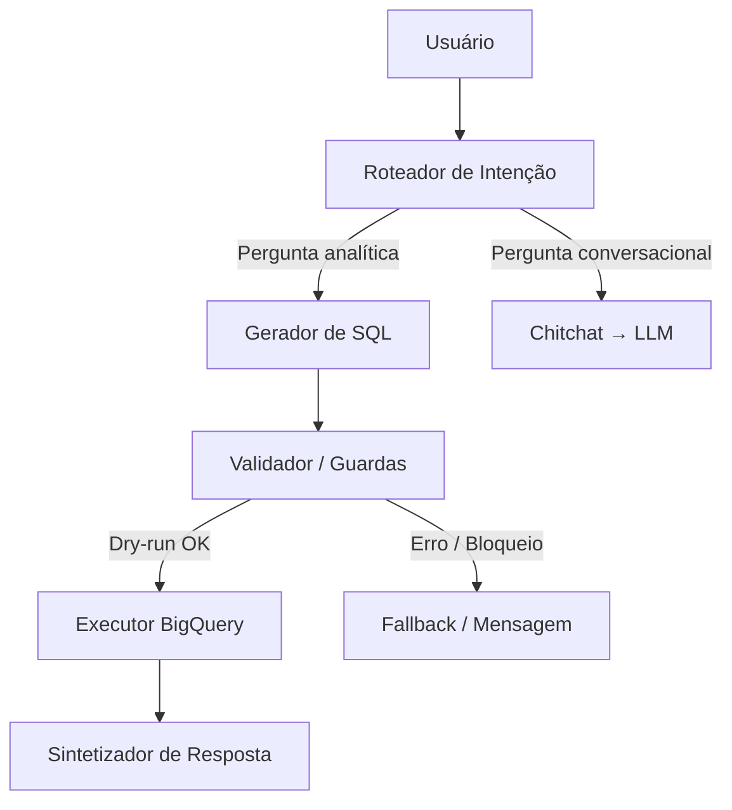

# Agente GenAI — Prefeitura do Rio (Desafio Técnico)

Agente de dados em **LangGraph** que entende perguntas em linguagem natural, gera **SQL eficiente** para o BigQuery (`datario`), valida via **dry-run**, executa e sintetiza a resposta em **PT-BR** (com **LLM opcional**).

---

## 📂 Tabelas centrais
- `datario.adm_central_atendimento_1746.chamado` (fatos, milhões de linhas, particionada por `data_particao = TRUNC(DATE(data_inicio))`)
- `datario.dados_mestres.bairro` (dimensão de bairros, usada em JOINs)

---

## ⚙️ Stack
- Python 3.12
- LangGraph / LangChain
- Google BigQuery (Sandbox / ADC)
- Pandas + PyArrow
- OpenAI GPT (`gpt-4o-mini`) para síntese (opcional)
- Ruff, pytest, pre-commit (qualidade de código)

---

## 🚀 Setup rápido

```bash
# Criar ambiente virtual
python3 -m venv .venv
source .venv/bin/activate

# Instalar dependências
pip install -r requirements.txt

# Copiar variáveis de ambiente
cp .env.example .env.local
# edite .env.local e insira sua OPENAI_API_KEY (opcional)

# Instalar hooks de pre-commit
pre-commit install
```

### 🔑 Variáveis de ambiente
No `.env.local`:
```bash
PROJECT_ID=genai-rio
BQ_LOCATION=US
BQ_MAX_BYTES_BILLED=1000000000   # guardião de custo
BQ_QUERY_TIMEOUT=30              # timeout em segundos
LLM_PROVIDER=OPENAI
OPENAI_MODEL=gpt-4o-mini
LLM_USE_FOR_SYNTH=1
OPENAI_API_KEY=sk-xxxxxxx        # opcional
```

---

## 📌 Uso

```bash
# Rodar o agente diretamente
python -m src.agent.graph "Quantos chamados foram abertos no dia 28/11/2024?"

# Testar as 6 perguntas do desafio com preview de DF e SQL
make accept

# Executar smoke test rápido
python smoke_test.py
```

---

## ✅ Testes

```bash
# Checagem de estilo/lint
make lint

# Rodar toda a suíte de testes unitários e end-to-end
make test

# Executar apenas os testes de aceitação
make accept
```

A suíte cobre:
- Roteamento de intenção (dados vs chitchat)  
- Geração e validação de SQL (sem `SELECT *`, com filtros de partição)  
- Execução real no BigQuery (com dry-run + execução real)  
- Síntese de resposta via LLM (quando habilitado)  
- Fallback determinístico quando LLM não está ativo  

---

## 🏗️ Arquitetura do agente

Fluxo principal (**LangGraph**):



### Nós principais:
1. **Roteador de Intenção** → classifica pergunta como `data` ou `chitchat`.  
2. **Gerador de SQL** → cria query otimizada (sem `SELECT *`, filtros por data, JOIN com bairros se necessário).  
3. **Validador/Guardas** → faz `dry-run`, coleta `bytes_processed`, bloqueia DML/DDL, aplica `maximum_bytes_billed`.  
4. **Executor de SQL** → roda no BigQuery e retorna `DataFrame`.  
5. **Sintetizador de Resposta** → gera texto em PT-BR com LLM (opcional) ou fallback determinístico.

### Extras implementados:
- **Janela temporal defensiva**: restringe a consultas dos **últimos 365 dias** se usuário não especificar período.  
- **Telemetria**: cada execução inclui `graph_version`, `latency_ms`, `dry_run_bytes`.  
- **Guardas de segurança**: apenas SELECT único; bloqueio de DML/DDL/multi-statement.  

---

## 📊 Resultados de aceitação (exemplos)

| Pergunta | Resposta esperada |
|----------|-------------------|
| Chamados em 28/11/2024 | **0 chamados** |
| Subtipo mais comum em Iluminação Pública | **Reparo de Luminária (~68.253)** |
| Top 3 bairros em reparo de buraco (2023) | **Campo Grande (9.836), Bangu (3.280), Santa Cruz (2.659)** |
| Unidade líder em fiscalização irregular | **GM-RIO — Guarda Municipal (~154.519)** |
| Saudação | Resposta simpática |
| Sugestões de brincadeiras para cachorro | Lista de atividades |

---

## 🛡️ Limites e Guardas

- **Dry-run obrigatório** antes de qualquer execução.  
- **Máximo de bytes processados** (`BQ_MAX_BYTES_BILLED`).  
- **Timeout configurável** (`BQ_QUERY_TIMEOUT`).  
- **Somente SELECT** de sentença única (sem DML, DDL, `EXECUTE IMMEDIATE`, multi-statement).  
- **Fallback determinístico** se LLM não estiver ativo.  

---

## 🛠️ Troubleshooting

- **Erro de autenticação GCP** → verifique `gcloud auth application-default login` e `PROJECT_ID`.  
- **Quota ou custo excedido** → ajuste `BQ_MAX_BYTES_BILLED` ou refine filtros de data.  
- **Chave LLM ausente** → o agente funciona em modo determinístico sem LLM.  
- **JOIN de bairros vazio** → confira se `id_bairro` precisa de `CAST` para `STRING`.  

---

## 📈 Critérios atendidos

- [x] **SQL eficiente** (sem `SELECT *`, filtragem defensiva, partições)  
- [x] **Dry-run** para prever custo/latência  
- [x] **Fallback robusto** se LLM não estiver ativo  
- [x] **Testes automatizados** (unitários, integração e aceitação)  
- [x] **Qualidade de código** (lint + pre-commit)  
- [x] **Documentação completa**  
- [x] **Guardas de segurança** (custo, timeout, bloqueio de DML/DDL)  

---

## 🔮 Próximos passos

- Clarificação interativa quando período não for especificado.  
- Validações semânticas adicionais antes de dry-run.  
- Observabilidade (latência, bytes processados) em dashboard.  
- Cache para FAQs/resultados recorrentes.  
- CI/CD com execução automática de lint + testes.